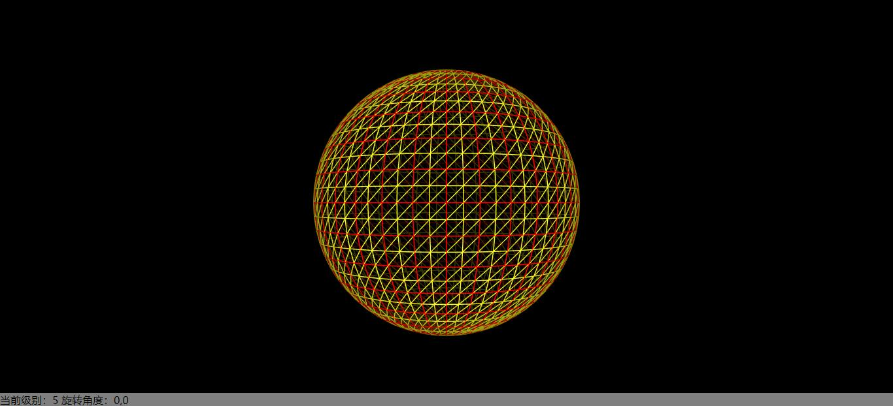

# 查看示例：http://www.talkgis.com/globe-demo/ #



纯js模拟webgl三维地球绘制过程，具体功能说明如下：

- 红色格网表示当前级别的瓦片范围，黄色格网表示webgl渲染的三角形带
- 三维球每放大一级会造成顶点数量成指数增长，为避免影响性能，只模拟了2-6级
- 按键盘的上、下、左、右可以旋转三维球，按+、-可以缩放三维球，没有做鼠标交互
- 这里面涉及到的缩放级别和中心角度都是自定义的，没有归算到标准的地图级别和经纬度
- 默认采用的epsg4490的瓦片进行模拟，如需要使用epsg3857的瓦片模拟，可以在开发模式修改投影参数

### 开发

```
yarn
yarn start
```

### 开始

```js
let options = {
  container: 'globe',  // div容器
  center: [0,0],       // 中心角度 [水平旋转角，垂直旋转角]
  zoom: 2,             // 模拟的缩放级别，取值2-6
  layers: ['tile','grid'],  // 显示的图层，'tile'为瓦片格网，'grid'为webgl三角形格网
  projection: 'epsg4490'    // 瓦片投影
}
let globe = new Globe(options)
```

### API

`setCenter(center)`

`setZoom(zoom)`

`setLayers(['tile'])`

`getCenter()`

`getZoom()`